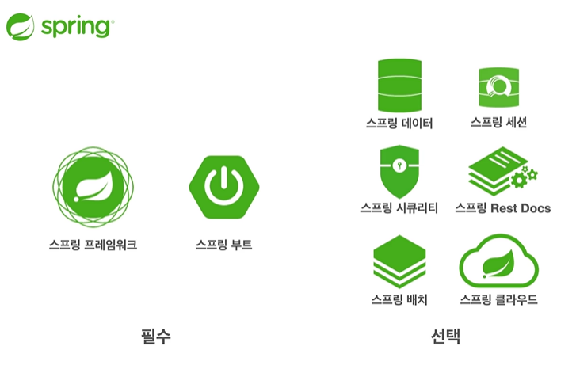
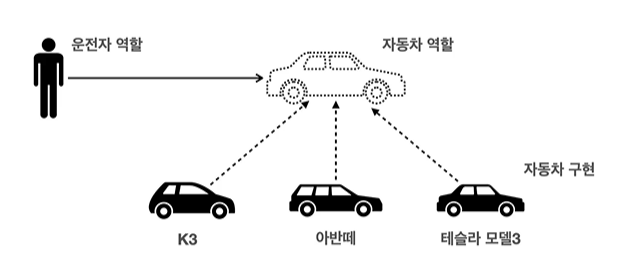
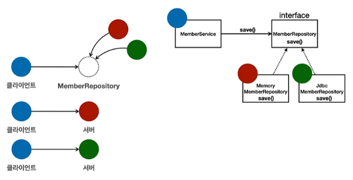

# 객체지향 설계와 스프링

## 스프링이란?

### 스프링 생태계

여러가지 기술들의 모음

**[필수] 스프링 프레임워크 (핵심) + 스프링 부트 (편리한 사용 도움)**

[선택] 스프링 데이터 (CRUD를 편리하게 도움 - Spring JPA) 등



<br/>

### 스프링 프레임워크

- 핵심 기술: 스프링 DI 컨테이너, AOP, 이벤트, 기타
- 웹 기술: 스프링 MVC, 스프링 WebFlux
- 데이터 접근 기술: 트랜잭션, JDBC, ORM, XML 지원

… 등등

<br/>

### 스프링 부트

- 스프링을 편리하게 사용할 수 있도록 지원, 최근에는 기본으로 사용
- 단독으로 실행할 수 있는 스프링 애플리케이션을 쉽게 생성

<br/>

### 스프링의 핵심 개념, 컨셉?

웹 애플리케이션 생성, DB 접근 편리, 웹 서버 자동, 클라우드 등…

→ 결과물일뿐!

- 스프링은 자바 언어 기반의 프레임워크
- 스프링은 **좋은 객체 지향** 애플리케이션을 개발할 수 있게 도와주는 프레임워크

<br/>

## 좋은 객체 지향 프로프래밍이란?

### 다형성

유연하고 변경이 용이하다.

- [예시] 자동차가 바뀌어도 운전자의 역할은 그대로 수행 가능
    - 클라이언트에 영향을 주지 않고 새로운 기능을 제공 가능
    - 역할과 구현으로 세상을 구분



<br/>

### 역할과 구현을 분리

- **역할(인터페이스)**과 **구현(클래스, 객체)**으로 구분하면 세상이 **단순**해지고, **유연**해지며 변경도 편해진다.
- 장점
    - 클라이언트는 대상의 역할 (인터페이스)만 알면 된다.
    - 클라이언트는 구현 대상의 **내부 구조를 몰라도** 된다.
    - 구현 대상의 **내부 구조가 바뀌어도** 영향받지 않으며,
    - **대상 자체를 변경**해도 영향받지 않는다.
- 객체 설계시 역할(인터페이스)을 먼저 부여하고, 그 역할을 수행하는 구현 객체를 만들기 *(역할이 더 중요!)*



<br/>

### 스프링과 객체 지향

- 다형성이 가장 중요!
- 스프링은 다형성을 극대화해서 이용할 수 있게 도와준다.
- 제어의 역전(loC), 의존관계 주입(DI)은 다형성을 활용해서 역할과 구현을 편리하게 다룰 수 있도록 지원

<br/>

### 좋은 객체 지향 설계의 5가지 원칙 (SOLID)

다형성과 함께 잘 알아야 하는 것!

: 클린코드로 유명한 로버트 마틴이 좋은 객체 지향 설계의 5가지 원칙을 정리

<br/>

### 1. SRP 단일 책임 원칙
(Single responsibility principle)

- 한 클래스는 하나의 책임만 가져야 한다.
- **중요한 기준은 변경!**
  변경이 있을 때 파급 효과가 적으면 SRP 잘 따른 것
- 예) UI 변경, 객체의 생성과 사용을 분리

### 2. OCP 개방-폐쇄 원칙 ★
(Open/closed principle)

- 소프트웨어 요소는 **확장에는 열려** 있으나 **변경에는 닫혀** 있어야 한다  .
- 문제점
    - MemberService 클라이언트가 구현 클래스를 직접 선택

        ```java
        MemberRepository m = new MemoryMemberRepository(); // 기존 코드
        MemberRepository m = new JdbcMemberRepository(); // 변경 코드
        ```

    - **구현 객체를 변경하려면 클라이언트 코드 (service)를 변경해야 한다.**
    - **분명 다형성을 사용했지만 OCP 원칙을 지킬 수 없다.**
    - 이 문제를 해결하는 방법
        - 객체를 생성하고, 연관관계를 맺어주는 별도의 조립, 설정자가 필요하다.
          → Spring 컨테이너의 역할

### 3. LSP 리스코프 치환 원칙
(Liskov substitution principle)

- 프로그램의 객체는 프로그램의 정확성을 깨뜨리지 않으면서 하위 타입의 인스턴스로 바꿀 수 있어야 한다
- 예) 자동자 인터페이스의 엑셀은 앞으로 가라는 기능, 뒤로 가게 구현하면 LSP 위반, 느리더라도 앞으로 가야함

### 4. ISP 인터페이스 분리 원칙
(Interface segregation principle)

- 특정 클라이언트를 위한 인터페이스 여러 개가 범용 인터페이스 하나보다 낫다
- 예) 자동자 인터페이스 → 운전자, 정비 인터페이스로 분리
  사용자 인터페이스 → 운전자, 정비사 클라이언트로 분리
- 분리하면 정비 인터페이스가 변해도 운전자 클라이언트에 영향X
- 인터페이스가 명확해지고, 대체 가능성이 높아진다.

### 5. DIP 의존관계 역전 원칙 ★
(Dependency inversion principle)

- **구현 클래스에 의존하지 말고, 인터페이스(역할)에 의존해라.**
    - “프로그래머는 추상화에 의존해야지, 구체화에 의존하면 안된다”

MemberService가 MemberRepository 인터페이스만 바라보고 다른 Repository에 대해서는 몰라야 한다는 의미

<br/>

### 정리

---

- 객체 지향의 핵심은 다형성
- 다형성만으로는 쉽게 부품을 갈아 끼우듯이 개발할 수 없다.
- 다형성만으로는 구현 객체를 변경할 때 클라이언트 코드도 함께 변경된다.
- 다형성만으로는 OCP, DIP를 지킬 수 없다.
- 뭔가 더 필요하다!

<br/>

### **객체 지향 설계와 스프링**

스프링은 아래와 같은 기술들로 `다형성` + `OCP`, `DIP`를 가능하게 지원을 해준다.

- DI : 의존관계, 의존 주입
- DI 컨테이너 제공

이 같은 기능들을 활용하여 **클라이언트 코드의 변경 없이 기능확장을 이루어낸다.**

그리고 쉽게 부품을 교체하듯이 개발을 할 수 있도록 지원한다.

<br/>
 
### **총 정리**

---

- 모든 설계에는 **역할**과 **구현**을 분리하자
- 좋은 객체 지향 설계는 **유연**하게 **변경**할 수 있도록 만드는 것이다.
- 이상적으로 모든 설계에 인터페이스를 부여하자

하지만 실무적인 고민이 있다.

- 인터페이스르 도입하면 추상화라는 비용이 발생한다.
- 기능을 확장할 가능성이 없다면, 구체 클래스를 직접 사용하고,향후 꼭 필요할 때 리팩터링해서 인터페이스를 도입하는 것도 방법이다.