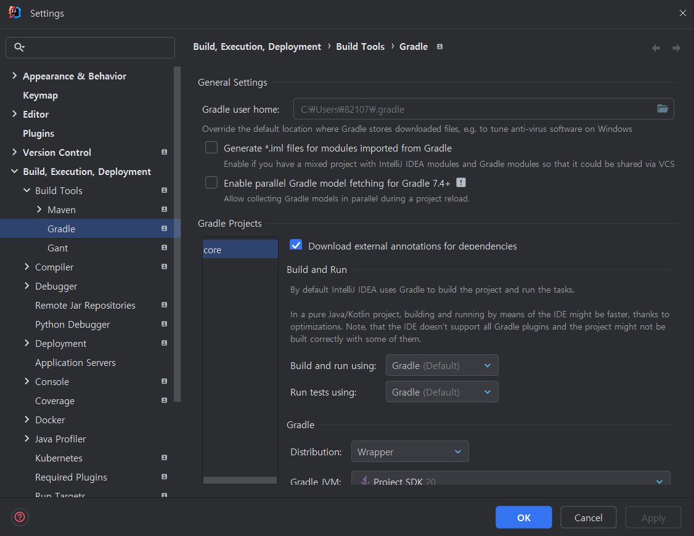
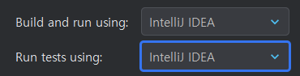
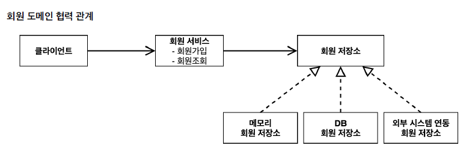
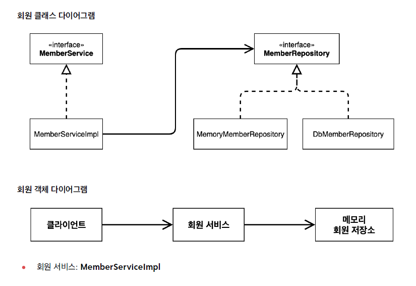
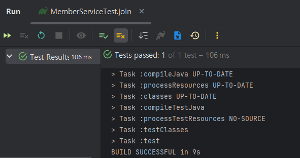
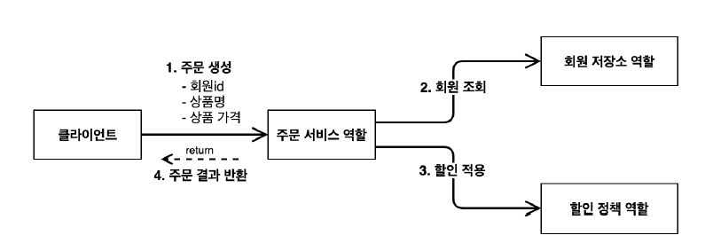
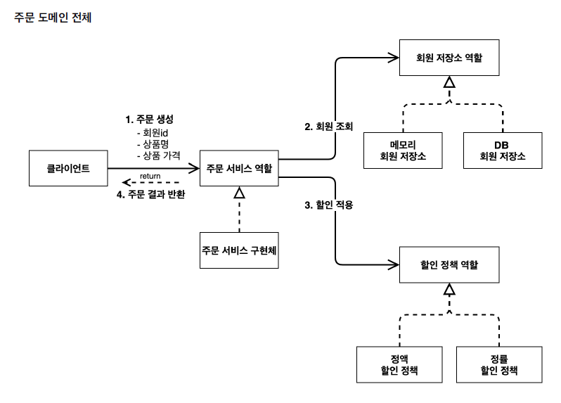

# 스프링 핵심 원리 이해1 - 예제 만들기

## 프로젝트  생성

[문제 상황] *이미지는 해결 후 캡쳐본임

- File>Setting>Preferences>Gradle에서 Gradle Projects 부분이 안 나올 때
  (Build and run using과 Run tests using을 Intellij로 변경해야 함)

  *→ Gradle로 하면 느리다. 실행 시 빌드 옵션을 Gradle에서 InteliJ IDEA로 바꿔주면 자바로 바로 실행시켜 실행속도가 더 빨라진다.*






- 혹은 우측 바에 Gradle이 없을 경우


<br/>
 
[해결방법]

- build.gradle 파일을 우클릭하면 “Link Gradle Project”가 나온다. 이걸 클릭하면 위의 두 가지 문제 상황이 모두 해결된다.

[참고 자료]

[[Flutter] Android Studio에서 View > Tool Windows > Gradle이 안 보일때 / Gradle 안에 Task가 안 보일때](https://ssue-dev.tistory.com/27)

<br/>

## 비즈니스 요구사항과 설계

### 회원 도메인 설계

- 요구사항
    - 회원을 가입하고 조회할 수 있다.
    - 회원은 일반과 VIP 두 가지 등급이 있다.
    - 회원 데이터는 자체 DB를 구축할 수 있고, 외부 시스템과 연동할 수 있다. (미확정)



<br/>

- MemberService라는 역할 → 인터페이스
- 그에 대한 구현체 → MemberServiceImpl



<br/>

## 회원 도메인 개발

### **IntelliJ IDEA 단축키 (Windows)**

- **Alt**+**Insert** : ****생성자 단축키
- **Shift+Alt+Enter** : 첫 번째 제안 적용
- **psvm** : public static void main
- **Ctrl+Alt+V** : 변수 추출하기
- 더 알아보기

  [IntelliJ IDEA 유용한 단축키들](https://velog.io/@janeljs/IntelliJ-IDEA-useful-shortcuts)


---

- 인터페이스와 구현체는 다른 패키지에 두는 것이 설계상 더 좋다!
  (실습에서는 편의상 같은 패키지에 둠)

<br/>

### JUnit 테스트 프레임워크

테스트 코드는 배포하면 빌드될 때 빠짐

- 이제는 선택이 아닌 필수다!

- 테스트 성공



<br/>

### 회원 도메인 설계의 문제점

- 다른 저장소로 변경할 때 OCP 원칙을 잘 준수하는가?
- DIP는 잘 지켜지고 있는가?

→ 의존 관계가 인터페이스 뿐만 아니라 구현까지 모두 의존하는 문제점이 있음

```java
package spring.core.member;

public class MemberServiceImpl implements MemberService {

    private final MemberRepository memberRepository = new MemoryMemberRepository(); // 오른쪽에 실제 할당하는 부분이 구현체를 의존하는 문제 발생

    @Override
    public  void join(Member member) {
        memberRepository.save(member);
    }

    @Override
    public  Member findMember(Long memberId) {
        return memberRepository.findById(memberId);
    }
}

```

<br/>

## 주문과 할인 도메인 설계

- 주문과 할인 정책
    - 회원은 상품을 주문할 수 있다.
    - 회원 등급에 따라 할인 정책을 적용할 수 있다.
    - 할인 정책은 모든 VIP는 1000원을 할인해주는 고정 금액 할인을 적용해달라.
      (나중에 변경 될 수 있다.)
    - 할인 정책은 변경 가능성이 높다. 회사의 기본 할인 정책을 아직 정하지 못했고, 오픈 직전까지 고민을 미루 고 싶다. 최악의 경우 할인을 적용하지 않을 수 도 있다. (미확정)





<br/>

## 주문과 할인 도메인 개발

- 아래처럼 역할이 잘 분리되어 할인 내용이 바뀌더라도 OrderServiceImpl의 변화가 없음
  → 단일 책임 원칙(SRP) 만족

```java
package spring.core.order;

import spring.core.discount.DisCountPolicy;
import spring.core.discount.FixDiscountPolicy;
import spring.core.member.Member;
import spring.core.member.MemberRepository;
import spring.core.member.MemoryMemberRepository;

public class OrderServiceImpl implements OrderService {

    private final MemberRepository memberRepository= new MemoryMemberRepository();
    private final DisCountPolicy discountPolicy = new FixDiscountPolicy();

    @Override
    public Order createOrder(Long memberId, String itemName, int itemPrice) {
        Member member = memberRepository.findById(memberId);
        // 할인에 대해서는 discountPolicy가 전부 담당 → 단일 책임 원칙 O
        int discountPrice = discountPolicy.discount(member, itemPrice);

        return new Order(memberId, itemName, itemPrice, discountPrice);
    }
}

```

<br/>

## 주문과 할인 도메인 실행과 테스트

애플리케이션 로직으로 이렇게 테스트 하는 것은 좋은 방법이 아니다. JUnit 테스트를 사용하자.

<br/>
 
---

## 추가 내용 정리

### Repository와 Service의 이해

*[궁금한 점] repository == 역할(interface), service == 구현체인가?*

<br/>

*[결론]*

Repository와 Service는 역할이 각각 다르다!

- Repository는 DB와 밀접한 객체이며,
  **DB에 접근하여 데이터를 조회, 저장, 삭제 등의 역할**을 한다.

  →즉, 직접 구현하지 않고 선언적으로 역할을 지정하는 인터페이스

- Service는 **핵심 비즈니스 로직**을 가지는 객체이다.

  → DB접근과는 상관없이 비즈니스적인 핵심적인 기능을 구현
  (보통 여러 `Repository`를 조합하여 작업하거나, 추가적인 로직을 구현)


예를 들어, 각각의 역할을 분리해놓음으로써 문제가 발생할 시

비즈니스 로직 상 문제가 없는것 같은데

DB 관련 처리에서 문제가 발생한다면 Repository코드를 확인해보면 된다!

각각의 역할이 분리되어 개발과 유지보수 등이 용이해진다는 장점을 가진다.

<hr/>

*[궁금한 점] 그렇다면 MemoryMemberRepository는 왜 interface가 아니라 class 객체인 것일까?*

<br/>

*[결론]*

`MemoryMemberRepository`가 `class`로 선언된 이유는 구현체로서 실제 동작을 정의하기 위함이다.

- `interface`와 `class`의 사용 여부는 **확장성**과 **추상화** 필요성에 따라 결정

- 만약 확장성을 고려하지 않는 간단한 프로젝트라면 인터페이스 없이 클래스로 선언해도 무방

그러나 유지보수와 확장성을 고려한다면, 인터페이스를 통해 설계하고, ```MemoryMemberRepository```는 그 인터페이스를 구현하는 방식으로 사용하는 것이 일반적이다!