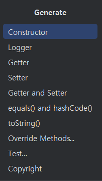
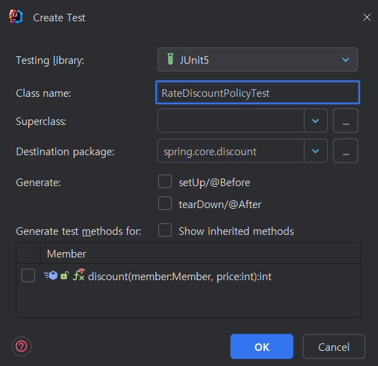
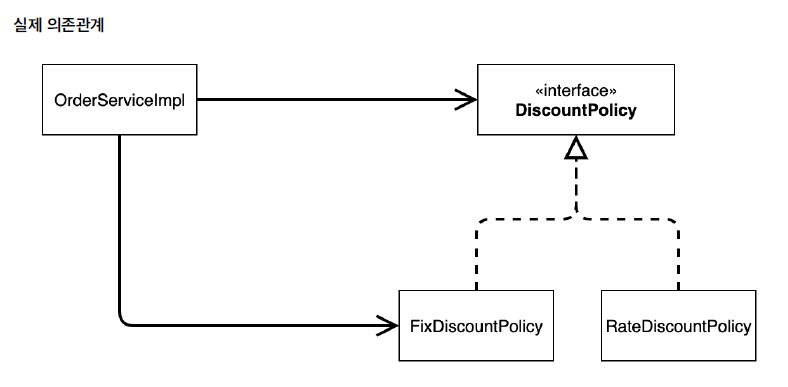
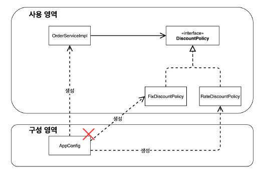
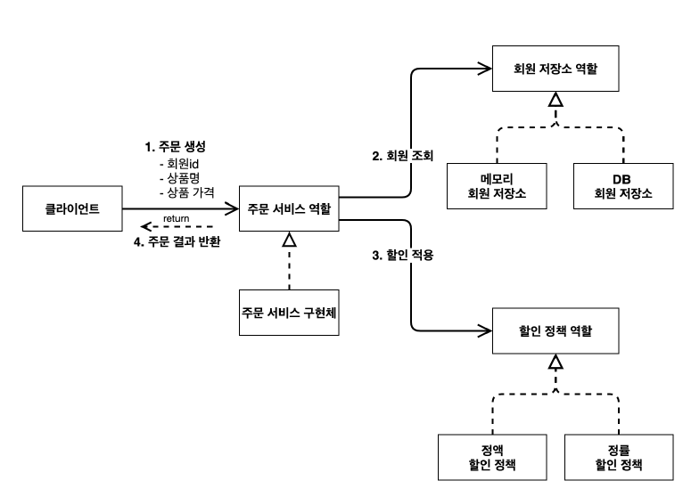

# 스프링 핵심 원리 이해2 - 객체 지향 원리 적용

## 새로운 할인 정책 개발

- **테스트 케이스**(**Test Case)** 생성
    - 다들 Ctrl+Shift+T로 된다는데… 나는 아무리해도 되지 않았다.
      → 그래서 아래 방법으로 생성하였다!
    - **alt + insert > Test 선택**

      
    
      


<br/>
 
### **RateDiscountPolicy 추가**

```java
package hello.core.discount;
import hello.core.member.Grade;
import hello.core.member.Member;
public class RateDiscountPolicy implements DiscountPolicy {
private int discountPercent = 10; //10% 할인
@Override
public int discount(Member member, int price) {
if (member.getGrade() == Grade.VIP) {
return price * discountPercent / 100;
} else {
return 0;
}
}
}
```

### 테스트 작성

```java
package spring.core.discount;

import org.assertj.core.api.Assertions;
import org.junit.jupiter.api.DisplayName;
import org.junit.jupiter.api.Test;
import spring.core.member.Grade;
import spring.core.member.Member;

import static org.junit.jupiter.api.Assertions.*;

class RateDiscountPolicyTest {
    RateDiscountPolicy discountPolicy = new RateDiscountPolicy();

    @Test
    @DisplayName("VIP는 10% 할인이 적용되어야 한다.")
    void vip_o() {
        // given
        Member member = new Member(1L, "memberVIP", Grade.VIP);
        // when
        int discount = discountPolicy.discount(member, 10000);
        // then
        Assertions.assertThat(discount).isEqualTo(1000);
    }
}
```

<br/>

## 새로운 할인 정책 적용과 문제점

```java
public class OrderServiceImpl implements OrderService {
// private final DiscountPolicy discountPolicy = new FixDiscountPolicy();
private final DiscountPolicy discountPolicy = new RateDiscountPolicy();
}
```

- DIP: 주문서비스 클라이언트(`OrderServiceImpl`)는 `DiscountPolicy` 인터페이스에 의존하면서 DIP를
  지킨 것 같은데?
    - 클래스 의존관계를 분석해 보자. 추상(인터페이스) 뿐만 아니라 **구체(구현) 클래스에도 의존**하고 있다.
        - 추상(인터페이스) 의존: `DiscountPolicy`
        - 구체(구현) 클래스: `FixDiscountPolicy` , `RateDiscountPolicy`
- OCP: 변경하지 않고 확장할 수 있다고 했는데!
  **지금 코드는 기능을 확장해서 변경하면, 클라이언트 코드에 영향을 준다!** 따라서 **OCP를 위반**한다.



[문제점] 항상 구체에 의존하지 말고 추상, **즉 인터페이스에 의존해야하는데**, 결과적으로 인터페이스도, 구체적인 것에도 의존하는 상황이 발생하였다. (DIP 위반)

→ 의존 관계가 있기 때문에 Fix에서 Rate로 변경될 때 OrderServiceImpl의 코드를 변경해야 하는 것! (OCP 위반)

>지금 상황은 예를 들어… 
<br/>자동차 운전면허증을 가진 차주가 기름차가 전기차로 바뀔 때 다시 라이센스를 발급 받아야 하는 상황이다. (원래라면, 기름차든 전기차는 운전자에게 아무 영향이 없어야 한다.)

<br/>

### 어떻게 해결해야할까?

- 클라이언트 코드인 `OrderServiceImpl` 은 `DiscountPolicy` 의 인터페이스 뿐만 아니라 구체 클래스도 함께 의존한다.
- 그래서 구체 클래스를 변경할 때 클라이언트 코드도 함께 변경해야 한다.
- **DIP 위반** 추상에만 의존하도록 변경(인터페이스에만 의존)

**⇒ 쉽게 말해, 인터페이스에만 의존하도록 설계를 변경하자!**

---

- **인터페이스에만 의존하도록 코드 변경**
    - 인터페이스에만 의존하도록 설계와 코드를 변경했다.
      **그런데 구현체가 없는데 어떻게 코드를 실행할 수 있을까?**

```java
public class OrderServiceImpl implements OrderService {
//private final DiscountPolicy discountPolicy = new RateDiscountPolicy();
private DiscountPolicy discountPolicy;
}
```

<br/>
 
**해결방안**

- 이 문제를 해결하려면 누군가가 클라이언트인 `OrderServiceImpl` 에 `DiscountPolicy` 의 구현 객체를 대신 생성하고 주입해주어야 한다.

<br/>

## 관심사 분리

- 애플리케이션을 하나의 공연으로 보아라. 실제 배역(인터페이스)에 맞는 배우(구현체)를 선택하는 것은 배우(구현체)가 아니다!

OrderServiceImpl은 Order 서비스와 관련된 로직만을 해야 되는데, 기존 코드에서는 얘가 DiscountPolish를 직접 선택하고 있었다. (fix를 할지, rate를 할지)

**관심사를 분리하자**

- 배우는 본인의 역할인 배역을 수행하는 것에만 집중해야 한다.
- 디카프리오는 어떤 여자 주인공이 선택되더라도 똑같이 공연을 할 수 있어야 한다.
- 공연을 구성하고, 담당 배우를 섭외하고, 역할에 맞는 배우를 지정하는 책임을 담당하는 별도의 **공연 기획자**가 나올 시점이다.
- 공연 기획자를 만들고, 배우와 공연 기획자의 책임을 확실히 분리하자.

<br/>

## AppConfig 등장

- 애플리케이션의 전체 동작 방식을 구성(config)하기 위해, **구현 객체를 생성**하고, **연결**하는 책임을 가지는 별도의 설정 클래스를 만들자.

**AppConfig**

- 애플리케이션의 실제 동작에 필요한 **구현 객체를 생성**한다.
- 생성한 객체 인스턴스의 참조(레퍼런스)를 **생성자를 통해서 주입(연결)**해준다.

```java
package spring.core;

import spring.core.discount.FixDiscountPolicy;
import spring.core.member.MemberService;
import spring.core.member.MemberServiceImpl;
import spring.core.member.MemoryMemberRepository;
import spring.core.order.OrderService;
import spring.core.order.OrderServiceImpl;

public class AppConfig {

    public MemberService memberService() {
        return new MemberServiceImpl(new MemoryMemberRepository());
    }

    public OrderService orderService() {
        return new OrderServiceImpl(new MemoryMemberRepository(), new FixDiscountPolicy()) {
        };
    }
}
```



<br/>


### 정리

- AppConfig를 통해서 관심사를 확실하게 분리했다.
- 배역, 배우를 생각해보자.
- AppConfig는 공연 기획자다.
- AppConfig는 구체 클래스를 선택한다. 배역에 맞는 담당 배우를 선택한다. 애플리케이션이 어떻게 동작해야 할지 전체 구성을 책임진다.
- 이제 각 배우들은 담당 기능을 실행하는 책임만 지면 된다.
  `OrderServiceImpl` 은 기능을 실행하는 책임만 지면 된다.

<br/>
<br/>

## AppConfig 리팩터링

중복을 지우고, **역할**에 따른 **구현**이 잘 보이도록 수정하였다.

```java
package spring.core;

import spring.core.discount.DisCountPolicy;
import spring.core.discount.FixDiscountPolicy;
import spring.core.member.MemberService;
import spring.core.member.MemberServiceImpl;
import spring.core.member.MemoryMemberRepository;
import spring.core.order.OrderService;
import spring.core.order.OrderServiceImpl;

public class AppConfig {

    public MemberService memberService() {
        return new MemberServiceImpl(memberRepository());
    }

    private MemoryMemberRepository memberRepository() {
        return new MemoryMemberRepository();
    }

    public OrderService orderService() {
        return new OrderServiceImpl(memberRepository(), disCountPolicy()) {
        };
    }

    public DisCountPolicy disCountPolicy() {
        return new FixDiscountPolicy();
    }
}
```



<br/>

## 새로운 구조와 할인 정책 적용

```java
public DiscountPolicy discountPolicy() {
	// return new FixDiscountPolicy();
	return new RateDiscountPolicy();
}
```

- `AppConfig`에서 할인 정책 역할을 담당하는 구현 `FixDiscountPolicy`에서 `RateDiscountPolicy`객체로 변경했다.
- 이제 할인 정책을 변경해도, 애플리케이션의 구성 역할을 담당하는 `AppConfig`만 변경하면 된다.
- 클라이언트 코드인 `OrderServiceImpl`를 포함해서 **사용 영역**의 어떤 코드도 변경할 필요가 없다.
  ***→ 사용 영역과 구성 영역(AppConfig)의 분리!***
- **구성 영역**은 당연히 변경된다. 구성 역할을 담당하는 `AppConfig`를 애플리케이션이라는 공연의 기획자로 생각하자. 공연 기획자는 공연 참여자인 구현 객체들을 모두 알아야 한다.


<br/><br/>

## 좋은 객체 지향 설계의 5가지 원칙의 적용

여기서 3가지 SRP, DIP, OCP 적용

### SRP 단일 책임 원칙

**한 클래스는 하나의 책임만 가져야 한다.**

- 클라이언트 객체는 직접 구현 객체를 생성하고, 연결하고, 실행하는 다양한 책임을 가지고 있음
- SRP 단일 책임 원칙을 따르면서 관심사를 분리함
- 구현 객체를 생성하고 연결하는 책임은 AppConfig가 담당
- 클라이언트 객체는 실행하는 책임만 담당

### DIP 의존관계 역전 원칙

**프로그래머는 “추상화에 의존해야지, 구체화에 의존하면 안된다.” 의존성 주입은 이 원칙을 따르는 방법 중 하나다.**

- 새로운 할인 정책을 개발하고, 적용하려고 하니 클라이언트 코드도 함께 변경해야 했다. 왜냐하면 기존 클라이언트 코드( `OrderServiceImpl` )는 DIP를 지키며 `DiscountPolicy` 추상화 인터페이스에 의존하는 것 같았지만, `FixDiscountPolicy` 구체화 구현 클래스에도 함께 의존했다.
- 클라이언트 코드가 `DiscountPolicy` 추상화 인터페이스에만 의존하도록 코드를 변경했다.
- 하지만 클라이언트 코드는 인터페이스만으로는 아무것도 실행할 수 없다.
- AppConfig가 `FixDiscountPolicy` 객체 인스턴스를 클라이언트 코드 대신 생성해서 클라이언트 코드에 의존관계를 주입했다. 이렇게해서 DIP 원칙을 따르면서 문제도 해결했다.

### OCP

**소프트웨어 요소는 확장에는 열려 있으나 변경에는 닫혀 있어야 한**

- 다형성 사용하고 클라이언트가 DIP를 지킴
- 애플리케이션을 사용 영역과 구성 영역으로 나눔
- AppConfig가 의존관계를 `FixDiscountPolicy` `RateDiscountPolicy` 로 변경해서 클라이언트 코드에 주입하므로 클라이언트 코드는 변경하지 않아도 됨
- **소프트웨어 요소를 새롭게 확장해도 사용 영역의 변경은 닫혀 있다!**

<br/><br/>

## IoC, DI, 그리고 컨테이너

### 제어의 역전 IoC(Inversion of Control)

- 이렇듯 프로그램의 제어 흐름을 직접 제어하는 것이 아니라 외부에서 관리하는 것
- 자신이 아닌 다른 구현 객체가 생성되고 실행되어도 알 수 없는 상태

** **프레임워크 vs 라이브러리**

- 프레임워크가 내가 작성한 코드를 제어하고, 대신 실행하면 그것은 프레임워크가 맞다. (JUnit)
- 반면에 내가 작성한 코드가 직접 제어의 흐름을 담당한다면 그것은 프레임워크가 아니라 라이브러리다.

<br/>

### 의존관계 주입 DI(Dependency Injection)

- 의존관계는 **정적인 클래스 의존 관계와, 실행 시점에 결정되는 동적인 객체(인스턴스) 의존 관계** 둘을 분리해서 생각해야 한다.

- 애플리케이션 **실행 시점(런타임)**에 외부에서 실제 구현 객체를 생성하고 클라이언트에 전달해서 클라이언트와 서버의 실제 의존관계가 연결 되는 것을 **의존관계 주입**이라 한다.
- 객체 인스턴스를 생성하고, 그 참조값을 전달해서 연결된다.
- 의존관계 주입을 사용하면 클라이언트 코드를 변경하지 않고, 클라이언트가 호출하는 대상의 타입 인스턴스를 변경할 수 있다.
- 의존관계 주입을 사용하면 정적인 클래스 의존관계를 변경하지 않고, 동적인 객체 인스턴스 의존관계를 쉽게 변경할 수 있다.

<br/>

### IoC 컨테이너, DI 컨테이너

- `AppConfig` 처럼 객체를 생성하고 관리하면서 의존관계를 연결해 주는 것을 IoC 컨테이너 또는 **DI 컨테이너**라 한다.
- 의존관계 주입에 초점을 맞추어 최근에는 주로 DI 컨테이너라 한다.
- 또는 어샘블러, 오브젝트 팩토리 등으로 불리기도 한다.

---

## 스프링(Spring)으로 전환하기

**AppConfig 스프링 기반으로 변경**

- AppConfig에 설정을 구성한다는 뜻의 `@Configuration` 을 붙여준다.
- 각 메서드에 `@Bean` 을 붙여준다. 이렇게 하면 스프링 컨테이너에 스프링 빈으로 등록한다.

**스프링 컨테이너**

- `ApplicationContext` 를 스프링 컨테이너라 한다.
- 기존에는 개발자가 `AppConfig` 를 사용해서 직접 객체를 생성하고 DI를 했지만, 이제부터는 스프링 컨테이너를 통해서 사용한다.
- 스프링 컨테이너는 `@Configuration` 이 붙은 `AppConfig` 를 설정(구성) 정보로 사용한다. 여기서 `@Bean` 이라 적힌 메서드를 모두 호출해서 반환된 객체를 스프링 컨테이너에 등록한다. 이렇게 스프링 컨테이너에 등록된 객체를 스프링 빈이라 한다.
- 스프링 빈은 `@Bean` 이 붙은 메서드의 명을 스프링 빈의 이름으로 사용한다. ( `memberService` ,`orderService` )
- 이전에는 개발자가 필요한 객체를 `AppConfig` 를 사용해서 직접 조회했지만, 이제부터는 스프링 컨테이너를 통해서 필요한 스프링 빈(객체)를 찾아야 한다. 스프링 빈 `applicationContext.getBean()` 메서드를 사용해서 찾을 수 있다.
- 기존에는 개발자가 직접 자바 코드로 모든 것을 했다면 이제부터는 스프링 컨테이너에 객체를 스프링 빈으로 등록하고, 스프링 컨테이너에서 스프링 빈을 찾아서 사용하도록 변경되었다.
- 코드가 약간 더 복잡해진 것 같은데, 스프링 컨테이너를 사용하면 어떤 장점이 있을까?


<br/><br/><br/>